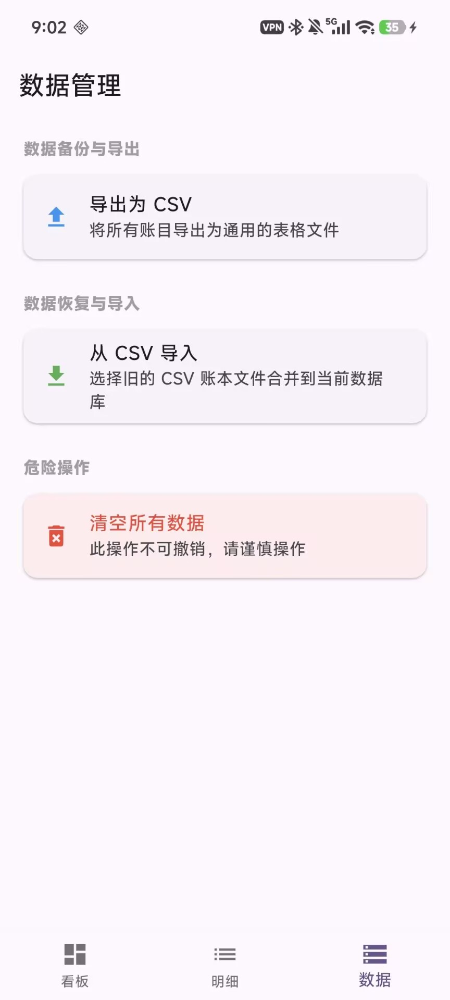
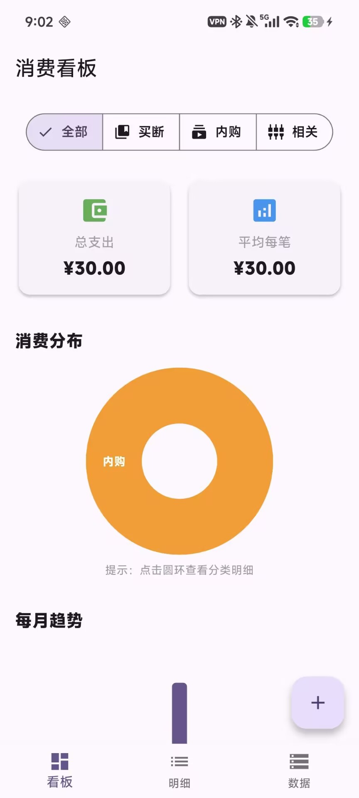

# 游戏账本(Game Accounting)

一个简单的跨平台（Windows & Android）游戏消费管理应用。(初版为基于Streamlit Web开发)。
<<<<<<< HEAD

=======
>>>>>>> c4b3120e9365bb21a885cca41a7800c0728ca3e9
完全基于**Vibe Coding**完成。

## ✨ 核心功能

- **智能录入**：支持厂商与游戏搜索，自动匹配分类，极简录入流程。
- **深度统计**：
    - **买断制 (Library)**：追踪单机游戏库的资产价值。
    - **内购/订阅 (Service)**：监控网游月卡、通行证等持续性支出。
    - **游戏相关 (Related)**：记录周边、外设等相关消费。
- **交互式图表**：支持柱状图与饼图，点击即可“展开”查看具体游戏的明细。
- **数据管理**：支持一键导出/导入通用 CSV 文件，本地 SQLite 存储确保隐私与离线可用。

## 🚀 快速开始

### 安卓端
1. 在 [Releases](../../releases) 页面下载最新的 `app-arm64-v8a-release.apk`。
2. 安装并赋予存储权限（用于导出数据）。
3. 首次启动可前往“数据”页导入旧版的 `game_expenses.csv`。

#### 📱 界面预览 (Preview)
<div align="center">
  
  
  
</div>

### 开发环境
- Flutter SDK: ^3.x
- Dart: ^3.x
- Database: Drift (SQLite)

```bash
# 获取依赖
flutter pub get

# 生成数据库代码
flutter pub run build_runner build

# 运行应用
flutter run
```

## 📄 开源协议
本项目采用 [MIT License](LICENSE) 协议开源。
